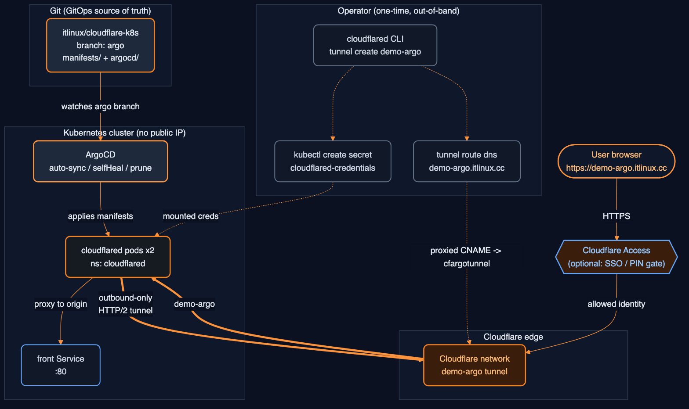

# Cloudflare Tunnel on Kubernetes — ArgoCD GitOps (demo-argo)

Deploy a Cloudflare Tunnel connector (`cloudflared`) into a Kubernetes cluster
with **ArgoCD**, so Services are reachable on a public hostname **without
exposing any public IP / LoadBalancer**. The tunnel (`demo-argo`) is built
manually; ArgoCD manages the in-cluster connector via GitOps.

---

## Architecture

```
 Internet ──▶ Cloudflare edge ──▶ demo-argo tunnel ──▶ cloudflared pods ──▶ Service
   (DNS: demo-argo.itlinux.cc)        (outbound-only)     (in cluster)      (front:80)
```



**Flow, end to end:**

1. **GitOps source** — the `argo` branch holds `manifests/` (cloudflared Deployment + ConfigMap) and `argocd/` (the Application CR).
2. **ArgoCD** watches the `argo` branch and applies the manifests into the `cloudflared` namespace (auto-sync, selfHeal, prune).
3. **Operator (one-time, out-of-band)** — builds the `demo-argo` tunnel with the `cloudflared` CLI, loads its `credentials.json` as a Secret, and creates the DNS route. None of this is in git.
4. **cloudflared pods** mount the creds Secret and open an **outbound-only HTTP/2 tunnel** to the Cloudflare edge — no inbound ports, no public IP.
5. **User traffic** hits `https://demo-argo.itlinux.cc` → Cloudflare edge → the `demo-argo` tunnel → a cloudflared pod → the in-cluster `front` Service.

- **No inbound exposure** — `cloudflared` dials *out* to Cloudflare; nothing is opened on the cluster.
- **ArgoCD** continuously reconciles the connector Deployment/ConfigMap to the `argo` branch.
- **Tunnel credentials** live in a Kubernetes Secret created **out-of-band** — never in git.

---

## Repository layout (`argo` branch)

```
manifests/
  cloudflared.yml        # Deployment (2 replicas, HA) + ConfigMap (tunnel: demo-argo)
  kustomization.yaml     # pins the cloudflared image tag (no :latest drift)
argocd/
  application.yaml       # ArgoCD Application CR — points at manifests/
README-argocd.md         # this document
.gitignore               # keeps credentials.json out of git
```

---

## Prerequisites

- A running Kubernetes cluster with `kubectl` access (EKS, GKE, k3s, …).
- **ArgoCD** installed in the cluster (namespace `argocd`).
- `cloudflared` CLI on your workstation.
- A domain managed in Cloudflare (this guide uses `demo-argo.itlinux.cc`).

---

## Step 1 — Build the tunnel + credentials Secret (one-time, NOT GitOps-managed)

The `demo-argo` tunnel is created manually. Its `credentials.json` becomes the
`cloudflared-credentials` Secret that the Deployment mounts. The ConfigMap’s
`tunnel: demo-argo` must match this tunnel.

### Where does `cloudflared` run to *create* the tunnel?

Creating the tunnel and running the connector are **two separate things**:

- **Creating the tunnel** is a one-time admin action. You run the `cloudflared`
  CLI **wherever you have it** — your **laptop/workstation** is fine. It does
  **not** have to run on the cluster or a server. The CLI just registers the
  tunnel with Cloudflare and writes the `credentials.json` locally.
- **Running the connector** is what actually serves traffic — that’s the
  `cloudflared` **pods in Kubernetes** (managed by ArgoCD). They consume the
  credentials you generated.

So: create on your laptop → load the creds into the cluster → ArgoCD runs the
connector. You can even create the tunnel on one machine and never run a
connector there at all.

### Two ways to create the tunnel

**Option 1 — CLI (from your laptop):**

```bash
cloudflared login                      # browser auth — pick the itlinux.cc zone
cloudflared tunnel create demo-argo    # writes ~/.cloudflared/<TUNNEL-ID>.json

kubectl create namespace cloudflared

# Load the tunnel creds as the Secret (key name MUST be credentials.json)
TID=$(cloudflared tunnel list --output json \
  | python3 -c "import sys,json;print([t['id'] for t in json.load(sys.stdin) if t['name']=='demo-argo'][0])")
kubectl -n cloudflared create secret generic cloudflared-credentials \
  --from-file=credentials.json="$HOME/.cloudflared/${TID}.json"

# Route the public hostname to the tunnel (creates the proxied CNAME)
cloudflared tunnel route dns demo-argo demo-argo.itlinux.cc
```

**Option 2 — Dashboard (no CLI needed):**

Zero Trust → **Networks → Tunnels → Create a tunnel** → **Cloudflared** →
name it `demo-argo`. The dashboard shows an install/run command containing a
**tunnel token** — for a dashboard-created (“remotely-managed”) tunnel you use
that **token** instead of a `credentials.json` file:

```bash
# Dashboard-managed tunnel: store the token as the Secret instead of creds file
kubectl create namespace cloudflared
kubectl -n cloudflared create secret generic cloudflared-credentials \
  --from-literal=token='<TUNNEL-TOKEN-from-dashboard>'
```

Then run the connector with `tunnel run --token` instead of a config file. If you
go this route, change the Deployment args to:
`["tunnel", "run", "--token", "$(TUNNEL_TOKEN)"]` and inject the token via an
env var from the Secret. Public hostnames + routes are configured in the
dashboard’s tunnel UI rather than the ConfigMap `ingress:` block.

> This README’s manifests use the **CLI / credentials-file** model (Option 1),
> which keeps the routing config in git (the ConfigMap `ingress:`). The dashboard
> token model moves routing into the Cloudflare UI — pick one, don’t mix.

> **Never commit `credentials.json` or the tunnel token.** They are the tunnel
> secret. ArgoCD is configured to ignore this Secret so a sync/prune never
> deletes or manages it.

---

## Step 2 — The Kubernetes manifest (`manifests/cloudflared.yml`)

```yaml
apiVersion: apps/v1
kind: Deployment
metadata:
  name: cloudflared
  labels: { app: cloudflared }
spec:
  selector:
    matchLabels: { app: cloudflared }
  replicas: 2                       # HA: 2 connectors share the same tunnel
  template:
    metadata:
      labels: { app: cloudflared }
    spec:
      containers:
        - name: cloudflared
          image: cloudflare/cloudflared:latest   # tag pinned via kustomization.yaml
          args: ["tunnel", "--config", "/etc/cloudflared/config.yaml", "run"]
          livenessProbe:
            httpGet: { path: /ready, port: 2000 }
            failureThreshold: 1
            initialDelaySeconds: 10
            periodSeconds: 10
          resources:
            requests: { cpu: 50m, memory: 64Mi }
            limits:   { cpu: 200m, memory: 128Mi }
          volumeMounts:
            - { name: config, mountPath: /etc/cloudflared, readOnly: true }
            - { name: creds,  mountPath: /etc/cloudflared/creds, readOnly: true }
      volumes:
        - name: creds
          secret: { secretName: cloudflared-credentials }
        - name: config
          configMap:
            name: cloudflared
            items: [{ key: config.yaml, path: config.yaml }]
---
apiVersion: v1
kind: ConfigMap
metadata:
  name: cloudflared
data:
  config.yaml: |
    tunnel: demo-argo
    protocol: http2                 # EKS/overlay-CNI safe (avoids QUIC MTU flaps)
    metrics: 0.0.0.0:2000
    no-autoupdate: true
    credentials-file: /etc/cloudflared/creds/credentials.json
    ingress:
    - hostname: "demo-argo.itlinux.cc"
      service: http://front.default.svc.cluster.local:80
    - service: http_status:404
```

`manifests/kustomization.yaml` pins the image so syncs are reproducible:

```yaml
apiVersion: kustomize.config.k8s.io/v1beta1
kind: Kustomization
resources:
  - cloudflared.yml
images:
  - name: cloudflare/cloudflared
    newTag: "2026.6.1"
```

---

## Step 3 — The ArgoCD Application (`argocd/application.yaml`)

```yaml
apiVersion: argoproj.io/v1alpha1
kind: Application
metadata:
  name: cloudflared
  namespace: argocd
  finalizers:
    - resources-finalizer.argocd.argoproj.io
spec:
  project: default
  source:
    repoURL: https://github.com/itlinux/cloudflare-k8s.git
    targetRevision: argo            # the branch
    path: manifests                 # kustomize dir
  destination:
    server: https://kubernetes.default.svc
    namespace: cloudflared
  syncPolicy:
    automated:
      prune: true                   # remove resources deleted from git
      selfHeal: true                # revert manual drift back to git
    syncOptions:
      - CreateNamespace=true
  ignoreDifferences:                # never manage/prune the out-of-band Secret
    - group: ""
      kind: Secret
      name: cloudflared-credentials
      jsonPointers: ["/data"]
```

---

## Step 4 — Register + sync

```bash
# Register the Application
kubectl apply -f argocd/application.yaml

# …or via the ArgoCD CLI
argocd app create cloudflared \
  --repo https://github.com/itlinux/cloudflare-k8s.git \
  --revision argo --path manifests \
  --dest-server https://kubernetes.default.svc \
  --dest-namespace cloudflared \
  --sync-policy automated --auto-prune --self-heal \
  --sync-option CreateNamespace=true

# Sync + verify
argocd app sync cloudflared
argocd app get cloudflared
kubectl -n cloudflared logs -l app=cloudflared --tail=20   # "Registered tunnel connection"
curl -I https://demo-argo.itlinux.cc                        # HTTP/2 200
```

---

## DNS routing + Access (who can reach the hostname)

### How DNS works with the tunnel

The public hostname must resolve to **the tunnel**, not to any server IP. `cloudflared tunnel route dns` creates a **proxied CNAME** in Cloudflare DNS:

```
demo-argo.itlinux.cc  CNAME  <tunnel-id>.cfargotunnel.com   (proxied / orange-cloud)
```

```bash
cloudflared tunnel route dns demo-argo demo-argo.itlinux.cc
dig +short demo-argo.itlinux.cc       # returns Cloudflare proxy IPs, NOT the cfargotunnel target
```

- The hostname here **must match** the `ingress:` hostname in the ConfigMap.
- The record is **proxied** (orange cloud) — that's what routes eyeball traffic through Cloudflare into the tunnel. A grey-cloud/DNS-only record will NOT work.
- One tunnel can serve many hostnames — add more `ingress:` entries and a `route dns` per hostname.

### Option A — Open to everyone (public service)

Just the tunnel + DNS above. Anyone on the internet can reach
`https://demo-argo.itlinux.cc`; the connector proxies to the in-cluster Service.
Use for public sites/APIs. No identity check.

### Option B — Gated by Cloudflare Access (authenticated users only)

Put **Zero Trust Access** in front of the same hostname so only authorized
identities (Entra/Okta/One-time PIN, etc.) can reach it. The tunnel/DNS/ArgoCD
setup is unchanged — Access is a policy layer on the hostname.

Dashboard: **Zero Trust → Access → Applications → Add → Self-hosted**
- **Application domain:** `demo-argo.itlinux.cc`
- **Identity providers:** select your IdP(s) (e.g. Entra) and/or One-time PIN
- **Policy:** Allow → Include → emails / email-domain / IdP groups
- Save. Now hitting the hostname shows the Access login page first; only
  users who pass the policy reach the cloudflared origin.

Terraform equivalent (self-hosted Access app + policy):

```hcl
resource "cloudflare_zero_trust_access_application" "demo_argo" {
  account_id       = var.cloudflare_account_id
  name             = "Demo Argo (k8s)"
  domain           = "demo-argo.itlinux.cc"
  session_duration = "1h"
  # Show the login picker (SSO + One-time PIN); no auto-redirect.
  allowed_idps              = compact([var.entra_idp_id, var.otp_idp_id])
  auto_redirect_to_identity = false
}

resource "cloudflare_zero_trust_access_policy" "demo_argo_allow" {
  application_id = cloudflare_zero_trust_access_application.demo_argo.id
  account_id     = var.cloudflare_account_id
  name           = "Allow team"
  decision       = "allow"
  precedence     = 1
  include = [{ email_domain = { domain = "itlinux.cc" } }]
}
```

| | Open (Option A) | Access-gated (Option B) |
|---|---|---|
| Who reaches it | anyone | only identities passing the policy |
| Login screen | none | Cloudflare Access (SSO / PIN) |
| Extra setup | tunnel + DNS only | + Access application & policy |
| Tunnel/ArgoCD config | same | same (Access is hostname-layer) |

> Access protects the **hostname at the edge** — it does not change the tunnel,
> the ConfigMap, or the ArgoCD sync. You can flip a hostname between open and
> gated without touching the cluster.

---

## How redeploys work (GitOps)

With `automated` + `selfHeal` + `prune`, ArgoCD continuously reconciles the
cluster to the `argo` branch:

| You do… | ArgoCD does… |
|---|---|
| Push a manifest change (image tag, ingress, replicas) | Auto-syncs it to the cluster |
| `kubectl edit` manual drift | Reverts it back to git state (selfHeal) |
| Remove a resource from git | Prunes it from the cluster |
| (anything to `cloudflared-credentials`) | Ignores it — never managed/pruned |

**Redeploy = `git push` to `argo`.** No manual `kubectl apply` needed.

---

## Troubleshooting

- **Tunnel flaps** (`control stream encountered a failure`, `datagram handler … context canceled`):
  QUIC datagrams hitting a reduced MTU on an overlay CNI (Calico VXLAN/IPIP, EKS).
  Already mitigated by `protocol: http2` in the ConfigMap. After editing, ArgoCD
  re-syncs; or `kubectl -n cloudflared rollout restart deploy/cloudflared`.
- **`no such host` / 502 for the origin:** the backend Service named in `ingress`
  doesn’t exist in that namespace. Create it (e.g. `kubectl create deployment front
  --image=nginx && kubectl expose deployment front --port=80`).
- **Hostname won’t resolve:** ensure the DNS route exists —
  `cloudflared tunnel route dns demo-argo demo-argo.itlinux.cc`.
